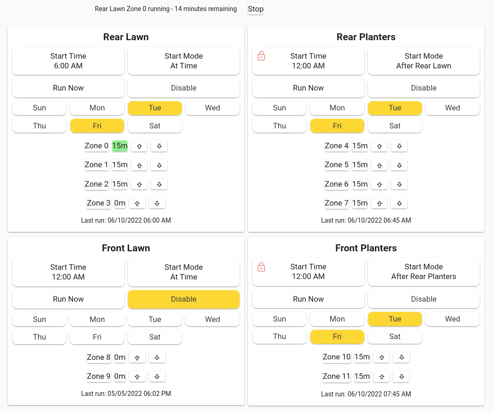

# Home Assistant Configuration

This is my [Home Assistant](https://home-assistant.io) configuration.  I
run Home Assistant using [Podman](https://podman.io) and the Home Assistant
[container](https://hub.docker.com/r/homeassistant/home-assistant).

My configuration is done as much as possible with [YAML](https://yaml.org)
files.  To make this easier I've written a YAML preprocessor ([yamlpp](yamlpp.md))
that allows you to reduce the repetitious nature of a YAML-based
configuration and make the files more manageable.

I use [GNU Make](https://www.gnu.org/software/make) to build and install
the configuration.

I'm using the following custom cards and modules:

- [Button Card](https://github.com/custom-cards/button-card)
- [Layout Card](https://github.com/thomasloven/lovelace-layout-card)
- [Restriction Card](https://github.com/iantrich/restriction-card)
- [Card Mod](https://github.com/thomasloven/lovelace-card-mod)

These are the devices I'm currently using with Home Assistant:

- Lights
- Pool
- Security System
- [Sprinklers](#Sprinklers)

I plan to document all of these here eventually.

## Sprinklers

This is my sprinkler dashboard:

Sprinkler zones are grouped into areas.  Each area can start either at a
specified time or can be chained to start after another area has finished.
An area can be started on demand using Run Now which will ignore the Disable
and day selections.  However, chained areas will obey the Disable and day
selections (I haven't decided if I like this or not).

I've built my own sprinkler controller using a Raspberry PI and some
relays.  The valves are controlled via a UDP interface.  Sending a valve number
will turn on the corresponding valve and turn off any other valve that was
on.  Sending the command 'off' will turn off all valves.  The hostname and
port for the UDP interface are set using the SPRINKER_HOST and SPRINKLER_PORT
macros.

### Todo

- Individual zone control

## License

_Licensed under the MIT License, Copyright (c) 2022 Greg Renda_
